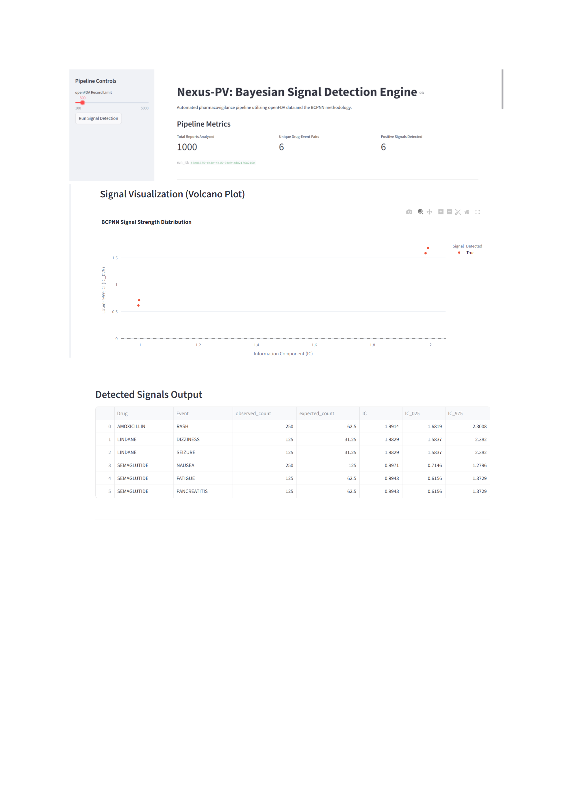
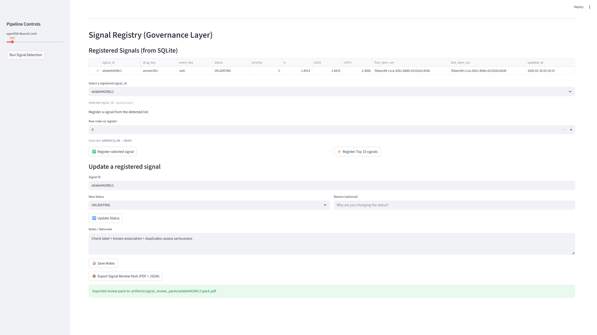
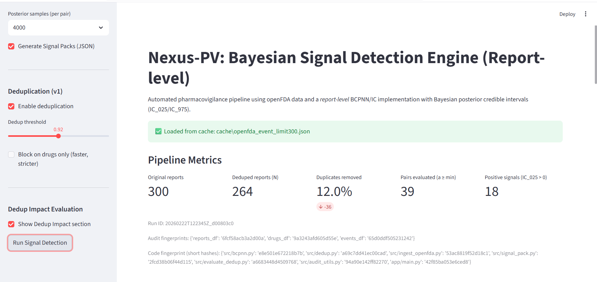
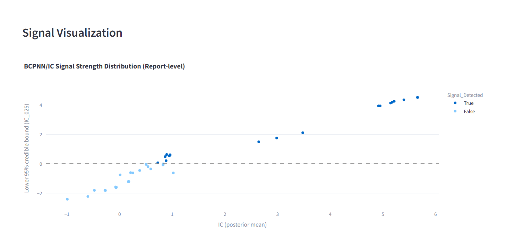
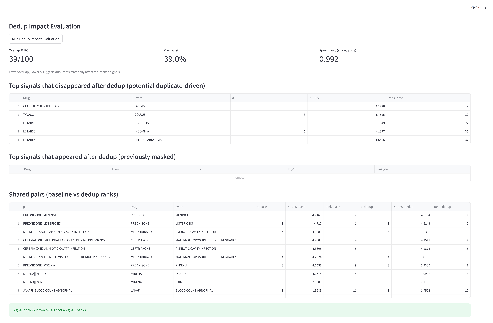

````markdown
# Nexus-PV — Automated Pharmacovigilance Signal Detection Engine  
*(openFDA → Bayesian BCPNN/IC → Signal Governance → Review Packs)*

[](https://github.com/sid7k/pharmacovigilance-bayesian-engine/actions/workflows/tests.yml)

Nexus-PV is an automated pharmacovigilance (PV) signal detection engine designed for **report-level** safety signal mining from **openFDA FAERS** data.  
It supports **Bayesian BCPNN / Information Component (IC)** with posterior uncertainty (**IC_025 / IC_975**), and a lightweight **signal governance layer** (registry + lifecycle + audit log) with exportable review artifacts.

> Focus: reproducible, auditable analytics suitable for research, evaluation, and engineering demonstration.

---

## Screenshots

**Signal Engine (metrics + volcano plot + detected signals)**


**Signal Registry (registry table + lifecycle + review pack export)**


**Cache-first run + audit artefacts (engine)**


**Signal visualization (IC vs IC_025)**


**Dedup impact evaluation (Overlap@100 + Spearman ρ)**


---

## What it does (end-to-end workflow)

1. **Ingest (openFDA FAERS)**
   - Reliable ingestion with retries, chunked pagination, IPv4 forcing  
   - Optional **cache-first mode**: loads cached `cache/openfda_event_limit*.json` if available

2. **Signal Detection**
   - **Report-level** BCPNN / IC
   - Bayesian posterior sampling for **IC_025 / IC_975** credible intervals

3. **Signal Governance (Registry)**
   - Register signals in a **SQLite** registry for tracking
   - Lifecycle statuses: **DETECTED → VALIDATING → ASSESSED → CLOSED**
   - Rationale / notes stored per signal

4. **Audit Trail**
   - Immutable **append-only JSONL** audit log (`data/registry/audit_log.jsonl`)
   - Tracks actions like register, status change, notes updates (with timestamps)

5. **Signal Review Packs**
   - Export **PDF + JSON** “Signal Review Pack” per signal with provenance metadata (e.g., `run_id`, parameters)

*(Optional/legacy if present in your branch)*  
6. **Deduplicate (v1) + Dedup Impact Evaluation**
   - Overlap@K (e.g., Overlap@100)
   - Spearman rank correlation
   - Tables: disappeared / appeared / shared signals

---

## Key Features

- ✅ **Report-level** unit of analysis (N = safety reports)
- ✅ Bayesian posterior IC with **IC_025 / IC_975** (credible intervals)
- ✅ Streamlit UI with `session_state` persistence (results survive button clicks)
- ✅ **Signal Registry (SQLite)** + lifecycle state transitions
- ✅ **Immutable audit log (JSONL)** for governance actions
- ✅ Exportable **Signal Review Packs (PDF + JSON)** with provenance
- ✅ openFDA reliability: retries + pagination + IPv4 forcing (+ optional cache-first)

---

## Repository Layout (high-level)

- `app/` — Streamlit UI (`app/main.py`)
- `src/fetch_fda.py` — openFDA ingestion + caching/retries (if enabled)
- `src/bcpnn.py` — BCPNN / IC computation + Bayesian IC intervals
- `src/registry/` — governance layer
  - `db.py` — SQLite schema/init
  - `service.py` — register/update status/notes
  - `audit.py` — append-only audit log writer
  - `export_pack.py` — PDF/JSON review pack export
- `data/registry/` — runtime data (created locally)
  - `registry.sqlite`
  - `audit_log.jsonl`
- `artifacts/signal_review_packs/` — exported packs (created locally)
- `screenshots/` — app screenshots
- `tests/` — unit tests (if present)
- `.github/workflows/tests.yml` — GitHub Actions CI workflow

---

## Quickstart

### 1) Create environment
```bash
python -m venv .venv
source .venv/bin/activate  # Windows: .venv\Scripts\activate
pip install -r requirements.txt
````

### 2) Run the Streamlit app

```bash
streamlit run app/main.py
```

---

## How to use the app (click-by-click)

### Run signal detection

1. Set **openFDA Record Limit** (start with 300–1000)
2. Click **Run Signal Detection**
3. Review:

   * Pipeline Metrics (N reports, pairs, signals)
   * Volcano plot (IC vs IC_025)
   * Detected signals table

### Register & govern signals

1. In **Signal Registry**, select a detected signal (row index)
2. Click **Register selected signal**
3. Use the registry table dropdown to select a `signal_id`
4. Update:

   * status (DETECTED → VALIDATING → ASSESSED → CLOSED)
   * reason + notes/rationale

### Export a Signal Review Pack

1. Select a registered `signal_id`
2. Click **Export Signal Review Pack (PDF + JSON)**
3. Output is written to:

   * `artifacts/signal_review_packs/<signal_id>/pack.pdf`
   * `artifacts/signal_review_packs/<signal_id>/pack.json`

---

## Outputs

### Audit artifacts (governance)

* SQLite registry:

  * `data/registry/registry.sqlite`
* Append-only audit log:

  * `data/registry/audit_log.jsonl`

### Review packs

* `artifacts/signal_review_packs/<signal_id>/pack.pdf`
* `artifacts/signal_review_packs/<signal_id>/pack.json`

---

## Local Files (Not Committed)

Nexus-PV generates local runtime files that are intentionally **not committed** to GitHub:

* `data/registry/` — SQLite registry + JSONL audit log
* `artifacts/signal_review_packs/` — exported PDF/JSON review packs
* `cache/` — cached openFDA payloads (optional)
* `.venv/` — local Python environment

---

## Tests

Run locally:

```bash
pytest -q
```

CI (if configured) runs on every push/PR via:

* `.github/workflows/tests.yml`

---

## Regulatory & Method Notes (Important)

Nexus-PV is a **research / engineering demonstration** of:

* signal detection analytics
* lightweight signal governance (registry + lifecycle)
* audit logging + reproducible artifacts

A production MHRA/EMA-grade signal management system typically also requires:

* validated data pipelines and controlled vocabularies (e.g., MedDRA, RxNorm)
* formal signal management processes, role-based approvals, and SOP alignment
* comprehensive quality system documentation and validation

---

## Roadmap (next)

* MedDRA normalization + RxNorm ingredient mapping
* Temporal trending (time-sliced IC) and stratification
* Dedup v2: case-version aware logic + probabilistic linkage calibration (if you maintain dedup branch)
* External validation plan (e.g., OMOP/RWD confirmation)
* Expanded tests and reproducibility report generation

---

## Disclaimer

This software is for **research and engineering demonstration** only.
It does not replace medical judgment, formal pharmacovigilance processes, or regulatory obligations, and is **not intended for clinical decision-making**.

---

## License / Commercial Use

This repository is intended for **non-commercial use**.
For commercial use, licensing, or productization discussions, please contact: **[yurekasid7k@gmail.com](mailto:yurekasid7k@gmail.com)**

```
```
